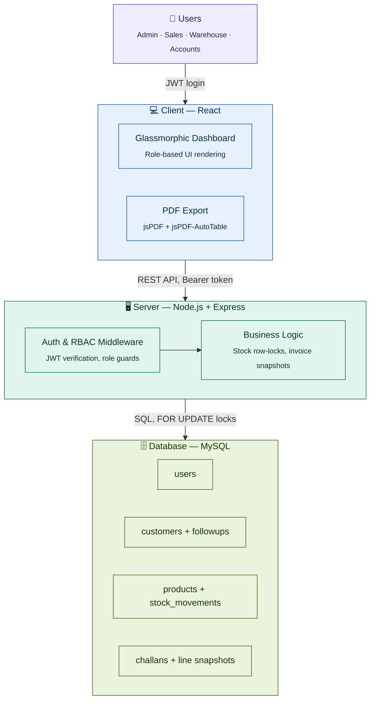

# 🏢 Mini ERP + CRM Operations Portal

A complete, responsive, full-stack **ERP + CRM** system built for wholesale/distribution businesses — covering customer relationship management, inventory tracking, and sales invoicing in one unified dashboard.

🔗 **Repo:** [github.com/Sumanjali-93/mini-erp-crm](https://github.com/Sumanjali-93/mini-erp-crm)


**Tags:** `full-stack` `erp` `crm` `inventory-management` `sales-invoicing` `mysql` `express-js` `react-js` `jwt-authentication` `role-based-access-control` `rest-api` `transactional-sql` `pdf-generation` `responsive-design` `node-js` `mern-style-stack`

---

## 📌 Overview

This portal simulates a real-world back-office system used by distribution companies to manage:
- **Customers** — CRM pipeline with follow-up history
- **Inventory** — stock levels, movement logs, low-stock alerts
- **Sales** — challans/invoices with automatic stock deduction and PDF export

It's designed to demonstrate **production-grade patterns**: role-based auth, transactional database writes, data snapshotting, and a polished responsive UI — not just CRUD boilerplate.

---

## 🏗️ High-Level Architecture



**Flow:** Users authenticate into the React client → client calls the Express REST API with a JWT Bearer token → the server's Auth/RBAC layer validates the role, then hands off to business logic (stock locking, invoice snapshotting) → server persists to MySQL using row-level locks so concurrent sales never oversell inventory.

**Design highlights:**
| Concern | How it's handled |
|---|---|
| **Data integrity under load** | Stock updates use MySQL `FOR UPDATE` row locks so concurrent sales never oversell inventory |
| **Historical accuracy** | Confirmed invoices store a JSON *snapshot* of product details, so past invoices stay correct even if prices/catalog change later |
| **Security** | JWT-based auth with role checks enforced per-route on the server (not just hidden in the UI) |
| **UX** | Responsive glassmorphic design, client-side PDF invoice generation, success animations |

---

## 🧰 Tech Stack

| Layer | Technology |
|---|---|
| Frontend | React, CSS (custom glassmorphic UI) |
| Backend | Node.js, Express.js |
| Database | MySQL |
| Auth | JWT (JSON Web Tokens) |
| PDF Export | jsPDF + jsPDF-AutoTable |
| UX Polish | canvas-confetti |

---

## 📁 Project Structure

```
mini-erp-crm/
├── backend/          # Node.js + Express REST API, JWT auth, MySQL models
├── frontend/          # React client — dashboard, CRM, inventory, invoicing UI
└── README.md
```

## ⚙️ Getting Started

### Prerequisites
- [Node.js](https://nodejs.org/) installed
- A local MySQL instance running on `localhost:3306`

### Installation

```bash
# 1. Clone the repo
git clone https://github.com/Sumanjali-93/mini-erp-crm.git
cd mini-erp-crm

# 2. Install & run the backend
cd backend
npm install
npm start

# 3. In a new terminal, install & run the frontend
cd frontend
npm install
npm start
```

> On first run, the backend automatically creates the `mini_erp_crm` database, builds all required tables, and seeds default role-based accounts and sample inventory — **no manual DB setup needed.**

---

## 🔑 Test Login Credentials

| Username | Password | Role | Access |
| :--- | :--- | :--- | :--- |
| `admin` | `admin123` | **Admin** | Full access — CRM, inventory, invoicing |
| `sales` | `sales123` | **Sales** | Manage customers, log follow-ups, create sales challans |
| `warehouse` | `warehouse123` | **Warehouse** | Catalog products, adjust stock (IN/OUT) |
| `accounts` | `accounts123` | **Accounts** | View invoices, update challan status, export PDFs |

---

## 📡 REST API Reference

> All endpoints (except login) require header: `Authorization: Bearer <JWT_TOKEN>`

### 🔐 Auth
| Method | Endpoint | Description |
|---|---|---|
| `POST` | `/api/auth/login` | Login → returns JWT + user object |

### 👥 Customers (CRM)
| Method | Endpoint | Description | Access |
|---|---|---|---|
| `GET` | `/api/customers` | Paginated, searchable, filterable list | All roles |
| `GET` | `/api/customers/:id` | Customer detail + full follow-up timeline | All roles |
| `POST` | `/api/customers` | Add new customer | Admin/Sales |
| `PUT` | `/api/customers/:id` | Edit customer info | Admin/Sales |
| `POST` | `/api/customers/:id/followups` | Log a follow-up note | Admin/Sales |

### 📦 Inventory
| Method | Endpoint | Description | Access |
|---|---|---|---|
| `GET` | `/api/products` | Paginated list with low-stock filter | All roles |
| `GET` | `/api/products/:id` | Product detail + stock movement history | All roles |
| `POST` | `/api/products` | Catalog a new item | Admin/Warehouse |
| `PUT` | `/api/products/:id` | Edit product specs | Admin/Warehouse |
| `POST` | `/api/products/:id/stock-movement` | Adjust stock (IN/OUT) | Admin/Warehouse |

### 🧾 Sales Challans / Invoices
| Method | Endpoint | Description | Access |
|---|---|---|---|
| `GET` | `/api/challans` | List invoices (search/filter) | All roles |
| `GET` | `/api/challans/:id` | Invoice detail + snapshotted line items | All roles |
| `POST` | `/api/challans` | Create Draft/Confirmed order | Admin/Sales |
| `PUT` | `/api/challans/:id` | Update status (Confirm/Cancel) | Admin/Sales/Accounts |

**Business logic:**
- Confirming a challan → deducts stock, logs an `OUT` movement, **aborts if stock is insufficient**
- Cancelling a confirmed challan → restores stock, logs an `IN` movement

---

## ✨ Key Features at a Glance

- Role-based dashboards (4 distinct roles, server-enforced permissions)
- Concurrency-safe inventory using row-level DB locks
- Point-in-time invoice snapshots (immutable historical records)
- Auto low-stock alerts
- Client-side PDF invoice generation
- Fully responsive glassmorphic UI

---

## 📄 License

This project is available for demonstration and portfolio purposes.
